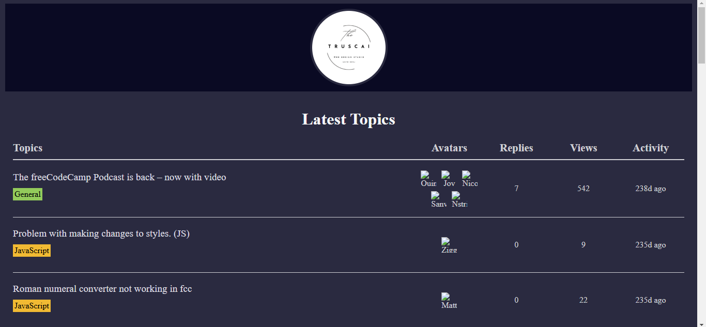

# Forum Leaderboard

JavaScript is an asynchronous programming language. And this project will help you gain proficiency in asynchronous concepts.

This project will cover the Fetch API, promises, Async/Await, and the try..catch statement.

# [live](https://sabovoichita.github.io/forum-leaderboard/)

